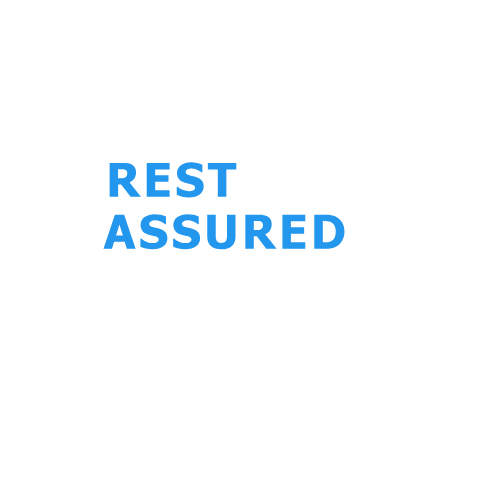
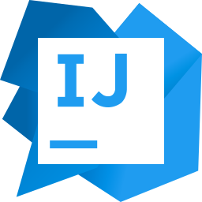

# 👨‍💻 Natanael Adler

**Software Quality Engineer** com sólida experiência em **Qualidade de Software**, atuando com foco em **testes automatizados**, **integração contínua** e **melhoria de processos**.

Atualmente atuo como **Analista de Teste/QA na Innova Tech One**, contribuindo para soluções tecnológicas robustas.

---

## 🛠️ Competências Técnicas

### **Testes, Automação e API**

  
  
  
  

- Robot Framework
- Cypress
- RestAssured
- Postman

---

### **Ferramentas e Tecnologias**

  
  
  
  
  
  
  
  

- Linguagens: JavaScript | Java
- Devops: Git | GitHub Actions | Docker
- DataBase: SQL
- IDE's: VSCODE & INTELLIJ

---

### **Colaboração e Gestão**

  
  
  
  
  

- Microsoft Teams | Google Meet | Zoom
- Trello | ClickUp

---

## 🏆 Sobre Mim

- Foco na **centralidade da qualidade** e na disseminação do **aprendizado contínuo**.
- Comprometido com a evolução como profissional e ser humano.
- Apaixonado por tecnologia e motivado a criar soluções de qualidade.

---

## 📚 Curiosidades

- Aprecio a **leitura** de livros, especialmente sobre tecnologia, desenvolvimento pessoal e filosofia.

---

## 🔗 Contato

---

